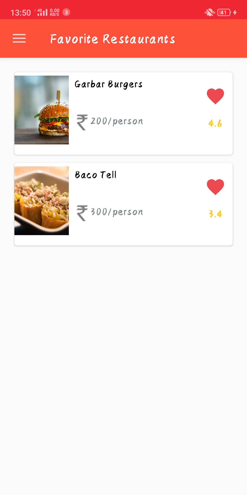

# FoodRunner
A Food Delivery Android App with various restaurants, multple menus. Users can mark their favorite restaurants and also track their order history.

<h3>Objective</h3> 
A Food Delivery Android App with various restaurants and multiple menu items in them. Users can mark their favorite restaurants and also track their order history. They can also sort restaurants by three parameters: rating, cost(high to low), cost(low to high).

***

<h3>Screenshots</h3>

      
           
      

      
      
      

